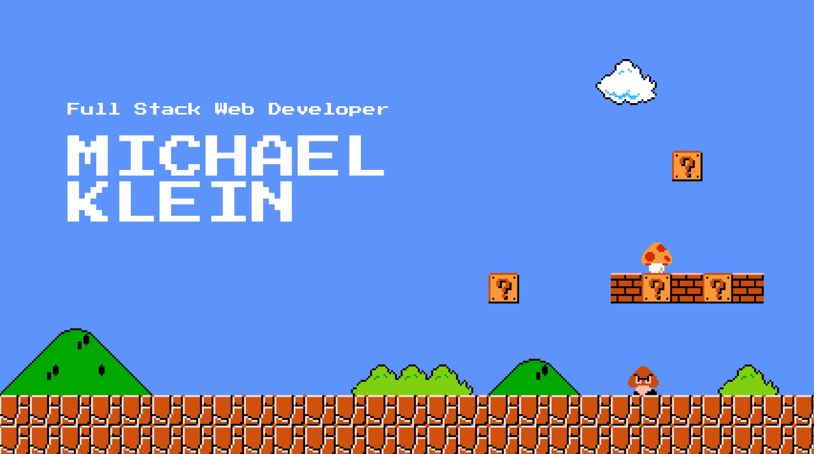
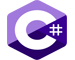

## About Me
:wave: Hi!  My name is Michael Klein and I am a **Full Stack Web Developer** with 3 years of development experience.
- :mortar_board: I have a B.S. in Biology and a minor in Chemistry.
- :fireworks: My dream job is to program firework shows.
- :cat: The luckiest cat dad out there :)
- :running_man: Smashing 100 miles per month
- :video_game: I hop on the sticks in my past time.

## Connect With Me!

[](mailto:michaelklein1997@gmail.com)
[](https://www.linkedin.com/in/michaeljosephklein/)
[](https://www.instagram.com/inklein1997/)
[](https://docs.google.com/document/d/13wgjALPAew1QubTti2xNGs2z75RIJSjGPYnktDMlePk/edit?usp=sharing)

## Top Technologies
### Languages




### Front End Technologies


### Back End Technologies


### Database


### Cloud


## Stats 

<!--START_SECTION:waka-->


**🐱 My GitHub Data** 

> 📦 134.1 kB Used in GitHub's Storage 
 > 
> 🏆 273 Contributions in the Year 2025
 > 
> 💼 Opted to Hire
 > 
> 📜 29 Public Repositories 
 > 
> 🔑 7 Private Repositories 
 > 
📊 **This Week I Spent My Time On** 

```text
💬 Programming Languages: 
Java                     13 hrs 49 mins      █████████░░░░░░░░░░░░░░░░   34.70 % 
Python                   6 hrs 55 mins       ████░░░░░░░░░░░░░░░░░░░░░   17.38 % 
JavaScript               6 hrs 1 min         ████░░░░░░░░░░░░░░░░░░░░░   15.11 % 
TypeScript               5 hrs 48 mins       ████░░░░░░░░░░░░░░░░░░░░░   14.56 % 
Markdown                 1 hr 34 mins        █░░░░░░░░░░░░░░░░░░░░░░░░   03.93 % 

🔥 Editors: 
IntelliJ IDEA            16 hrs 25 mins      ██████████░░░░░░░░░░░░░░░   41.22 % 
VS Code                  13 hrs 48 mins      █████████░░░░░░░░░░░░░░░░   34.63 % 
PyCharm                  9 hrs 37 mins       ██████░░░░░░░░░░░░░░░░░░░   24.14 % 

🐱‍💻 Projects: 
temp-reporter            9 hrs 35 mins       ██████░░░░░░░░░░░░░░░░░░░   24.06 % 
internal-lgc-jmc-config-g9 hrs 13 mins       ██████░░░░░░░░░░░░░░░░░░░   23.14 % 
fantasy-turned-real      5 hrs 2 mins        ███░░░░░░░░░░░░░░░░░░░░░░   12.66 % 
TVS-Commerce             4 hrs 1 min         ███░░░░░░░░░░░░░░░░░░░░░░   10.08 % 
jmc-config-generator     3 hrs 59 mins       ██░░░░░░░░░░░░░░░░░░░░░░░   10.00 % 

💻 Operating System: 
Mac                      21 hrs 14 mins      █████████████░░░░░░░░░░░░   53.30 % 
Windows                  18 hrs 36 mins      ████████████░░░░░░░░░░░░░   46.70 % 
```


 Last Updated on 08/03/2025 00:39:14 UTC
<!--END_SECTION:waka-->
