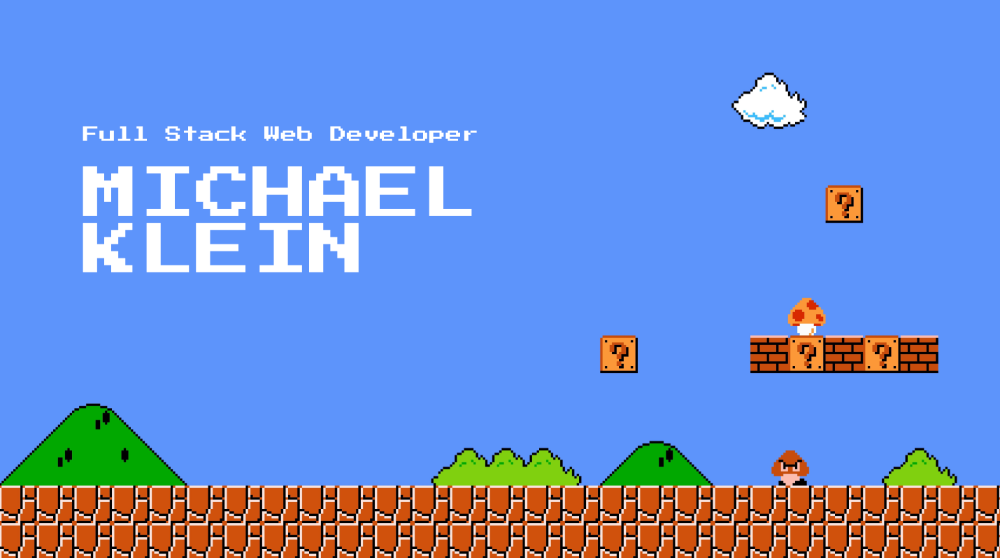

## About Me
:wave: Hi!  My name is Michael Klein and I am a **Full Stack Web Developer** with 3 years of development experience.
- :mortar_board: I have a B.S. in Biology and a minor in Chemistry.
- :fireworks: My dream job is to program firework shows.
- :cat: The luckiest cat dad out there :)
- :running_man: Smashing 100 miles per month
- :video_game: I hop on the sticks in my past time.

## Connect With Me!

[](mailto:michaelklein1997@gmail.com)
[](https://www.linkedin.com/in/michaeljosephklein/)
[](https://www.instagram.com/inklein1997/)
[](https://docs.google.com/document/d/13wgjALPAew1QubTti2xNGs2z75RIJSjGPYnktDMlePk/edit?usp=sharing)

## Top Technologies
### Languages


### Front End Technologies


### Back End Technologies


### Database


### Cloud


## Stats 

<!--START_SECTION:waka-->


**🐱 My GitHub Data** 

> 📦 143.3 kB Used in GitHub's Storage 
 > 
> 🏆 887 Contributions in the Year 2025
 > 
> 💼 Opted to Hire
 > 
> 📜 32 Public Repositories 
 > 
> 🔑 10 Private Repositories 
 > 
📊 **This Week I Spent My Time On** 

```text
💬 Programming Languages: 
TypeScript               14 hrs 57 mins      ████████████████░░░░░░░░░   62.04 % 
Markdown                 6 hrs 34 mins       ███████░░░░░░░░░░░░░░░░░░   27.27 % 
JSON                     2 hrs 32 mins       ███░░░░░░░░░░░░░░░░░░░░░░   10.52 % 
CSS                      2 mins              ░░░░░░░░░░░░░░░░░░░░░░░░░   00.15 % 
JavaScript               0 secs              ░░░░░░░░░░░░░░░░░░░░░░░░░   00.01 % 

🔥 Editors: 
VS Code                  24 hrs 7 mins       █████████████████████████   100.00 % 

🐱‍💻 Projects: 
Professional-Portfolio-V517 hrs 32 mins      ██████████████████░░░░░░░   72.73 % 
JumpMind Enablement Train6 hrs 34 mins       ███████░░░░░░░░░░░░░░░░░░   27.27 % 

💻 Operating System: 
Mac                      17 hrs 32 mins      ██████████████████░░░░░░░   72.73 % 
Windows                  6 hrs 34 mins       ███████░░░░░░░░░░░░░░░░░░   27.27 % 
```


 Last Updated on 27/12/2025 00:56:17 UTC
<!--END_SECTION:waka-->


